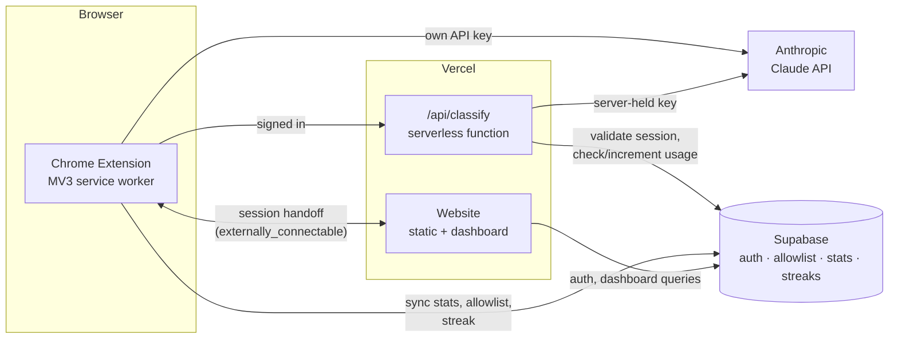

# Blockout

[](https://github.com/BenMathew824/blockout/actions/workflows/test.yml)

AI-powered study focus tool. Tell it what you're studying, start a session, and every
page you visit gets classified against that topic in real time — no manually maintained
blocklist, and no false blocks on a reference page that's actually relevant.

## How it works

1. Type what you're studying — as specific as you want ("Calculus 1", "the French
   Revolution", anything).
2. Start a focus session for a set duration or until a specific time.
3. Every page you visit — including single-page apps like YouTube, where the page never
   fully reloads — gets checked against your topic. Off-topic pages redirect instantly to
   a blocked screen with a short explanation of why.

## Features

- AI topic classification instead of a hardcoded blocklist
- Focus sessions with a live countdown shown right in the browser tab title
- An "Always Allow" list for reference sites you need mid-session
- A study streak and activity heatmap tracking consecutive days locked in
- Optional account (via the companion website) to sync stats and allowlist across
  devices — entirely optional, the extension works fully without one
- Two ways to classify: sign in for free classification through Blockout's own backend
  (rate-limited), or bring your own Anthropic API key for unlimited, direct-to-Anthropic
  requests with no account at all

## Architecture



Two independent paths get a page classified, and the extension tries them in order:

1. **Signed in, no key needed** — the extension calls the Vercel serverless function at
   `website/api/classify.js` with the user's Supabase access token. The function
   validates the session, checks/increments a per-day usage counter (via Postgres RLS —
   no service-role key needed), then calls Anthropic with a server-held key and returns
   the verdict. Nothing about the page (hostname/title/topic) is stored server-side —
   only the daily counter is.
2. **Bring your own key** — if there's no session, or the proxy is unreachable/over its
   cap, the extension falls back to calling Anthropic directly from the browser using a
   key the user saves locally. This is the only path Blockout's servers are never in.

Both paths share the same prompt and response parsing, and results are cached per
`url|title|topic` for the lifetime of the service worker to avoid reclassifying on every
tab-title tick.

## Tech stack

- **Extension**: vanilla JS, Manifest V3, no build step (plain `<script>` tags,
  `importScripts` for the service worker)
- **Website**: static HTML/CSS/JS with ES modules, deployed as a Vercel static site
- **Backend**: a single Vercel serverless function (`website/api/classify.js`)
- **Database/auth**: Supabase (Postgres + GoTrue), accessed via plain `fetch` — no SDK in
  the extension, `supabase-js` on the website
- **AI**: Anthropic's Claude (`claude-haiku-4-5`) for page-relevance classification
- **Tests**: Node's built-in `node:test` runner, zero dependencies

## Project structure

```
├── background.js        service worker: session timing, tab classification, sync
├── popup.html/js         extension popup UI
├── blocked.html/js       the page shown when a site is classified as off-topic
├── auth.js, sync.js      Supabase auth/session and best-effort stat sync
├── allowlist.js          pure allowlist-matching logic (extracted for testability)
├── config.js             Supabase + proxy URLs (fill in your own before deploying)
├── manifest.json
├── supabase-schema.sql   run once in the Supabase SQL editor
├── test/                 node:test suite
├── .github/workflows/    CI (runs the test suite on push/PR)
└── website/
    ├── index.html, dashboard.html, auth.html, privacy.html
    ├── dashboard.js, extensionBridge.js, streak.mjs, ...
    ├── supabaseClient.js
    └── api/classify.js   serverless proxy (see Architecture above)
```

## Setup

1. **Supabase**: create a project, then run `supabase-schema.sql` in the SQL editor. Copy
   your project URL and anon key into `config.js` (extension) and
   `website/supabaseClient.js` (website).
2. **Extension**: `chrome://extensions` → Developer mode → Load unpacked → select this
   directory.
3. **Website**: deploy the `website/` directory to Vercel. Set these environment
   variables on the Vercel project:
   - `SUPABASE_URL`, `SUPABASE_ANON_KEY` — same values as above
   - `ANTHROPIC_API_KEY` — server-held key used by the free/signed-in classification path
   - `CLASSIFY_DAILY_LIMIT` — optional, defaults to 200 requests/user/day
4. Replace the `YOUR-DEPLOYED-DOMAIN.vercel.app` placeholders in `manifest.json` and
   `config.js` with your actual deployed domain, then reload the unpacked extension.

## Testing

```
npm test
```

Runs on Node's built-in test runner (no dependencies to install). Covers the allowlist
matcher (`allowlist.js`) and the streak calculation (`sync.js` and its website
counterpart, `website/streak.mjs`) — both duplicated on purpose (see comments in those
files) since the extension's classic scripts and the website's ES modules aren't set up
to share code without a build step; the test suite cross-checks that both copies agree.
CI runs this on every push and pull request via `.github/workflows/test.yml`.
